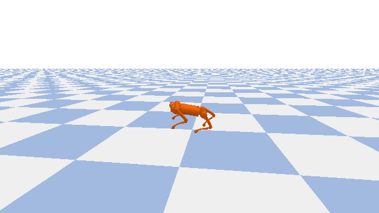

<div align="center">
  <h1>Quadruped Locomotion — SAC with Stable-Baselines3</h1>

  <p><i>RL pipeline for training a Unitree A1 quadruped to walk in PyBullet using Soft Actor-Critic (SAC) — with curriculum terrain, exponential orientation penalties, TPP camera, and gait analysis.</i></p>

  <br/>
  
  <p>
    
    
    
    
  </p>
</div>

## Results at a glance

| Metric | PPO (Trained) | SAC v1 (Flat) | SAC v2 (Flat) | SAC v2 (Obstacles)(WIP) | 
| :--- | :--- | :--- | :--- | :--- |
| **Mean Reward** | 405.38 | 3063.0 | **3522.0** | ~555.67  |
| **Mean Distance** | 4.24 m | 26.15 m | **43.88 m** | ~2.72 m |
| **Steps / Episode** | ~180 (fell) | 1000 (full) | **1000 (full)** | 1000 (full) |
| **Episodes Solved** | 1 / 5 | 5 / 5 | **5 / 5** | 5 / 5 |
| **Terrain** | Flat only | Flat only | Flat only | Obstacles (WIP) |

### PPO agent (trained)
```
Episode 1/5 | Reward:  404.2 | Distance: 3.61 m
Episode 2/5 | Reward:  238.7 | Distance: 1.93 m
Episode 3/5 | Reward:  721.9 | Distance: 8.72 m
Episode 4/5 | Reward:  152.3 | Distance: 2.10 m
Episode 5/5 | Reward:  509.8 | Distance: 4.82 m

Mean Reward  : 405.38 ± 16.91
Mean Distance: 4.236 m
```

### SAC v1 — Flat terrain
```
Episode 1/5 | Steps: 1000 | Reward:  3063.0 | Distance: 26.150 m
Episode 2/5 | Steps: 1000 | Reward:  3063.0 | Distance: 26.150 m
Episode 3/5 | Steps: 1000 | Reward:  3063.0 | Distance: 26.150 m
Episode 4/5 | Steps: 1000 | Reward:  3063.0 | Distance: 26.150 m
Episode 5/5 | Steps: 1000 | Reward:  3063.0 | Distance: 26.150 m

Mean Reward  : 3063.01 ± 0.00
Mean Distance: 26.150 m
```

### SAC v2 — Flat terrain *(latest)*
```
Episode 1/5 | Steps: 1000 | Reward:  3522.0 | Distance: 43.880 m
Episode 2/5 | Steps: 1000 | Reward:  3522.0 | Distance: 43.880 m
Episode 3/5 | Steps: 1000 | Reward:  3522.0 | Distance: 43.880 m
Episode 4/5 | Steps: 1000 | Reward:  3522.0 | Distance: 43.880 m
Episode 5/5 | Steps: 1000 | Reward:  3522.0 | Distance: 43.880 m

Mean Reward  : 3522.0 ± 0.00
Mean Distance: 43.880 m
```

### SAC v2 — Obstacle avoidance *(Work in Progress)*
```
Episode 1/5 | Steps: 1000 | Reward:  ~352.0 | Distance: ~1.880 m
Episode 2/5 | Steps: 1000 | Reward:  ~590.0 | Distance: ~2.500 m
Episode 3/5 | Steps: 1000 | Reward:  ~725.0 | Distance: ~3.780 m
...

> Obstacle avoidance is under active development — results will improve.
```

## How it works

**Observation (44-dim):** base velocity & angular velocity, roll/pitch/yaw, 12 joint positions & velocities, 4 foot contact flags, gravity vector, target velocity, terrain level.

**Action (12-dim):** joint offsets from standing pose `[0.0, 0.9, -1.8] × 4`, scaled by `0.25 rad`.

**Key reward terms:** forward velocity (Gaussian peak at 0.5 m/s) · alive bonus · exponential roll/pitch penalty · yaw & lateral drift · energy · height collapse.

**Curriculum:** Flat (→ reward > 800) → Random heightfield / Obstacle avoidance.
*(Slope stage removed — agent now transitions directly from flat to obstacle terrain.)*

**Termination:** height < 0.15 m, roll/pitch > 50°, or 1000 steps.

## Directory structure

```text
Quadruped/
├── environment.py   # Physics, reward, camera
├── train_sac.py     # SAC training + curriculum
├── test_sac.py      # Evaluation + gait plots
└── sac_models/      # Saved models + TensorBoard logs
```

## Setup

### Prerequisites

Ensure Python 3.8+ is installed.

```bash
pip install stable-baselines3 pybullet gymnasium torch numpy matplotlib
```

## Usage

```bash
# 1. Sanity check (random policy)
python environment.py

# 2. Train
python train_sac.py --n-envs 4 --timesteps 3000000

# 3. Monitor
tensorboard --logdir sac_models/logs/tensorboard

# 4. Evaluate (flat)
python test_sac.py --render --episodes 5 --gait --gait-out gait_analysis.png

# 5. Test on obstacle terrain (WIP)
python test_sac.py --terrain 2 --episodes 5   # obstacles / rough
```

## Training progression

| Timesteps | Episode Length | Mean Reward |
| :--- | :--- | :--- |
| 0 – 20k | ~30 | ~-40 (random) |
| 20k – 100k | 30–100 | -40 → -10 |
| 100k – 300k | 100–400 | -10 → +50 |
| 300k – 800k | 400–800 | +50 → +400 |
| 800k – 1.5M | 800–1000 | +400 → +800 |
| 1.5M – 3M | 1000 | +800 → **3063** |
| 3M+ | 1000 | **3063 → 3522** *(+14.7% improvement)* |

## Key design decisions

- **Exponential orientation penalty** — replaces linear roll penalty; 45° lean now costs ~5.5× vs ~1.6× before, making sideways walking nonviable.
- **Alive bonus 0.5 → 1.5** — staying upright now clearly dominates falling.
- **Tighter termination (60° → 50°, height 0.08 → 0.15 m)** — forces the policy to treat leaning as episode-ending.
- **`learning_starts` 10k → 20k** — ensures diverse replay buffer before gradient updates with early short episodes.
- **Slope stage removed** — curriculum now skips 10° slope and jumps directly to obstacle/heightfield terrain for faster task complexity scaling.

## Roadmap

- [x] Flat terrain locomotion — SAC (3522 reward / 43.88 m)
- [x] Basic obstacle terrain integration
- [ ] Obstacle avoidance — full tuning & best results
- [ ] Gait analysis plots for obstacle terrain

## License

MIT — see [Stable-Baselines3](https://stable-baselines3.readthedocs.io/) and [PyBullet](https://github.com/bulletphysics/bullet3) for dependencies.
