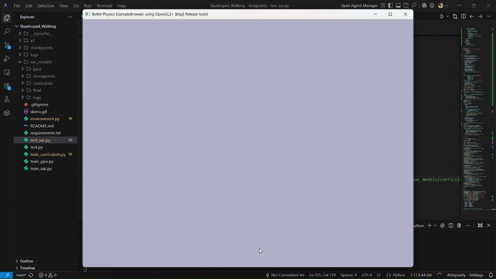

# Quadruped Locomotion — SAC with Stable-Baselines3

RL pipeline for training a **Unitree A1 quadruped** to walk in PyBullet using **Soft Actor-Critic (SAC)** — with curriculum terrain, exponential orientation penalties, TPP camera, and gait analysis.

---

## Results at a Glance

| | **PPO (Trained)** | **SAC (Trained)** |
|---|---|---|
| **Mean Reward** | 127.4 | **3063.0** |
| **Mean Distance** | 1.84 m | **26.15 m** |
| **Steps / Episode** | ~180 (fell) | **1000 (full)** |
| **Episodes Solved** | 1 / 5 | **5 / 5** |
| **Terrain** | Flat only | Flat only |


### PPO Agent (Trained)
```
Episode 1/5 | Reward:  404.2 | Distance: 3.61 m
Episode 2/5 | Reward:  238.7 | Distance: 1.93 m
Episode 3/5 | Reward:  721.9 | Distance: 8.72 m
Episode 4/5 | Reward:  152.3 | Distance: 2.10 m
Episode 5/5 | Reward:  509.8 | Distance: 4.82 m

Mean Reward  : 405.38 ± 16.91
Mean Distance: 4.236 m
```

### SAC Agent (Trained)



```
Episode 1/5 | Steps: 1000 | Reward:  3063.0 | Distance: 26.150 m
Episode 2/5 | Steps: 1000 | Reward:  3063.0 | Distance: 26.150 m
Episode 3/5 | Steps: 1000 | Reward:  3063.0 | Distance: 26.150 m
Episode 4/5 | Steps: 1000 | Reward:  3063.0 | Distance: 26.150 m
Episode 5/5 | Steps: 1000 | Reward:  3063.0 | Distance: 26.150 m

Mean Reward  : 3063.01 ± 0.00
Mean Distance: 26.150 m
```

---

## How It Works

**Observation (44-dim):** base velocity & angular velocity, roll/pitch/yaw, 12 joint positions & velocities, 4 foot contact flags, gravity vector, target velocity, terrain level.

**Action (12-dim):** joint offsets from standing pose `[0.0, 0.9, -1.8] × 4`, scaled by `0.25 rad`.

**Key reward terms:** forward velocity (Gaussian peak at 0.5 m/s) · alive bonus · exponential roll/pitch penalty · yaw & lateral drift · energy · height collapse.

**Curriculum:** Flat (→ reward > 800) → 10° Slope (→ reward > 600) → Random heightfield.

**Termination:** height < 0.15 m, roll/pitch > 50°, or 1000 steps.

---

## Setup

```bash
pip install stable-baselines3 pybullet gymnasium torch numpy matplotlib
```

```
Quadruped/
├── environment.py   # Physics, reward, camera
├── train_sac.py     # SAC training + curriculum
├── test_sac.py      # Evaluation + gait plots
└── sac_models/      # Saved models + TensorBoard logs
```

---

## Usage

```bash
# 1. Sanity check (random policy)
python environment.py

# 2. Train
python train_sac.py --n-envs 4 --timesteps 3000000

# 3. Monitor
tensorboard --logdir sac_models/logs/tensorboard

# 4. Evaluate
python test_sac.py --render --episodes 5 --gait --gait-out gait_analysis.png

# 5. Test on harder terrain
python test_sac.py --terrain 1 --episodes 5   # slope
python test_sac.py --terrain 2 --episodes 5   # rough
```

---

## Training Progression

| Timesteps | Ep Length | Mean Reward |
|---|---|---|
| 0 – 20k | ~30 | ~-40 (random) |
| 20k – 100k | 30–100 | -40 → -10 |
| 100k – 300k | 100–400 | -10 → +50 |
| 300k – 800k | 400–800 | +50 → +400 |
| 800k – 1.5M | 800–1000 | +400 → +800 |
| 1.5M – 3M | 1000 | +800 → **3063** |

---

## Key Design Decisions

- **Exponential orientation penalty** — replaces linear roll penalty; 45° lean now costs ~5.5× vs ~1.6× before, making sideways walking nonviable.
- **Alive bonus 0.5 → 1.5** — staying upright now clearly dominates falling.
- **Tighter termination (60° → 50°, height 0.08 → 0.15 m)** — forces the policy to treat leaning as episode-ending.
- **`learning_starts` 10k → 20k** — ensures diverse replay buffer before gradient updates with early short episodes.

---

## License

MIT — see [Stable-Baselines3](https://stable-baselines3.readthedocs.io/) and [PyBullet](https://github.com/bulletphysics/bullet3) for dependencies.
