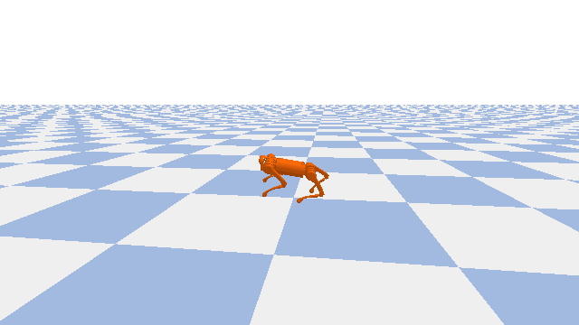

<div align="center">

# Quadruped Locomotion - PPO + PD Control

<p><i>
Reinforcement-learning pipeline for training a Unitree A1 quadruped to learn stable forward locomotion in PyBullet, using PPO as the high-level controller and an explicit joint-level PD controller for low-level torque control, with flat-to-uneven terrain curriculum evaluation.
</i></p>

<br/>



<p>
  
  
  
  
</p>

</div>

---

## Results at a glance

The project is divided into two locomotion tasks:

1. **Task 1  Flat terrain:** learn stable forward walking at a target velocity of 0.50 m/s.
2. **Task 2  Uneven terrain:** transfer the flat-terrain policy and progressively train it on smooth heightfield terrain.

### Task 1 - Flat terrain

| Metric | Result |
| :--- | :--- |
| **Training timesteps** | 2,000,896 |
| **Evaluation episodes** | 5 |
| **Episode length** | 1000 steps |
| **Episode duration** | ~16.67 s |
| **Mean reward** | **2860.48** |
| **Forward displacement** | **8.092 m** |
| **Mean Vx** | **0.486 m/s** |
| **Target velocity** | 0.50 m/s |
| **Velocity tracking** | **97.2%** |
| **Lateral drift** | **0.131 m** |
| **Drift / forward distance** | **1.61%** |
| **Max \|roll\|** | **4.81°** |
| **Max \|pitch\|** | **6.20°** |
| **Minimum base height** | **0.239 m** |
| **Maximum torque** | **14.25 Nm** |
| **Mean feet in contact** | **3.17** |
| **Full episodes** | **5 / 5** |

### Task 2 - Uneven terrain

Final Task 2 training used conservative transfer learning from the trained Task 1 policy.

| Metric | Result |
| :--- | :--- |
| **Training timesteps** | 500,000 |
| **Initial policy** | Task 1 trained PPO |
| **Terrain curriculum** | 0.05 → 0.10 → 0.15 → 0.20 → 0.25 |
| **Target velocity** | 0.50 m/s |
| **Difficulty 0.25** | **5 / 5 full episodes** |
| **Difficulty 0.50** | **5 / 5 full episodes** |
| **Difficulty 0.75** | **4 / 5 full episodes** |
| **Difficulty 1.00** | **3 / 5 full episodes** |


## Architecture

The controller is intentionally split into a high-level learning policy and a deterministic low-level controller:

```text
                 Observation
                     │
                     ▼
              ┌─────────────┐
              │     PPO     │
              │ High-level  │
              │ controller  │
              └──────┬──────┘
                     │
                     ▼
          Desired joint positions
                     │
                     ▼
              ┌─────────────┐
              │     PD      │
              │ Low-level   │
              │ controller  │
              └──────┬──────┘
                     │
                     ▼
                   Torque
                     │
                     ▼
              ┌─────────────┐
              │  PyBullet   │
              │  Unitree A1 │
              └──────┬──────┘
                     │
                     ▼
                 Observation
                     │
                     └──────────► PPO
```

The core control law is:

```text
τ = Kp(q_des − q) − Kd q̇
```

with the current controller using:

```text
Kp = 40
Kd = 1
Torque limit = 33.5 Nm
```

This architecture keeps the RL policy responsible for **locomotion behavior**, while the PD controller provides the low-level joint stabilization and torque conversion.

---


### Terrain generation

The terrain is generated as a heightfield:

```text
Rows       : 41
Columns    : 21
Cell size  : 0.4 m
```

The terrain height amplitude is controlled by:

```python
amplitude = 0.01 + 0.07 * difficulty
```

Therefore:

| Difficulty | Height amplitude |
| :---: | :---: |
| 0.00 | 1.0 cm |
| 0.10 | 1.7 cm |
| 0.25 | 2.75 cm |
| 0.50 | 4.5 cm |
| 0.75 | 6.25 cm |
| 1.00 | 8.0 cm |

The generated heightfield is smoothed before being used by the simulator.

**Difficulty represents terrain height variation; it is not a direct slope-angle setting.**


## Project structure

```text
Quadruped_Walking/
│
├── README.md
├── requirements.txt
├── .gitignore
├── demo.gif
│
├── controllers/
│   └── pd_controller.py
│
├── environments/
│   ├── env_flat_terrain.py
│   └── env_uneven_terrain.py
│
├── training/
│   ├── train_task1.py
│   └── train_task2.py
│
├── evaluation/
│   ├── evaluate_task1.py
│   ├── evaluate_task2.py
│   └── gait_results_task1.py
│
├── tests/
│   ├── test_task1_flat.py
│   └── test_task2_uneven.py
│
├── diagnostics/
│   └── ...
│
├── configs/
│   └── ...
│
├── checkpoints/
│   ├── task1_flat/
│   └── task2_terrain/
│
├── models/
│   ├── task1_flat/
│   └── task2_terrain/
│
└── logs/
    └── ...
```

---

## Setup

### Requirements

Recommended environment:

```text
Python 3.11.x
```

Install the project dependencies:

```bash
pip install -r requirements.txt
```

The project uses:

```text
PyBullet
Gymnasium
Stable-Baselines3
PyTorch
NumPy
Pandas
Matplotlib
TensorBoard
```

For GPU training, install the appropriate CUDA-enabled PyTorch build for the target machine.

---


## Training progression

### Task 1

```text
Environment validation
        ↓
PD standing validation
        ↓
Controlled-action validation
        ↓
Smooth action-rate limiting
        ↓
PPO training
        ↓
Flat-terrain evaluation
        ↓
Task 1 trained policy
```

### Task 2

```text
Task 1 trained policy
        ↓
difficulty 0.05
        ↓
difficulty 0.10
        ↓
difficulty 0.15
        ↓
difficulty 0.20
        ↓
difficulty 0.25
        ↓
Robustness evaluation
        ↓
0.50 / 0.75 / 1.00
```

---


## PPO + explicit PD controller

The project does not directly train PPO to output raw joint torques.

Instead:

```text
PPO → desired joint position → PD → torque
```

This separates high-level locomotion learning from low-level joint control and provides a bounded, interpretable torque interface.


### PD gains

The controller uses:

```text
Kp = 40
Kd = 1
```

with:

```text
|torque| ≤ 33.5 Nm
```

The low-level controller was validated before PPO training.


## Current limitations

- The current Task 2 terrain is a **smooth heightfield**, not a full obstacle-navigation benchmark.
- Terrain difficulty is controlled by height amplitude rather than a direct slope-angle parameter.
- Task 2 performance degrades as difficulty is pushed beyond the training curriculum.
- Difficulty 0.75 currently produces occasional failures.
- Difficulty 1.00 currently produces more frequent failures.
- The project focuses on forward locomotion rather than turning, recovery behaviors, or obstacle avoidance.
- The current observations are vision-free; terrain/object information is obtained directly from the simulation environment.

---


## License

MIT License.

This project uses open-source components including [Stable-Baselines3](https://github.com/DLR-RM/stable-baselines3), [Gymnasium](https://github.com/Farama-Foundation/Gymnasium), [PyBullet](https://github.com/bulletphysics/bullet3), and [PyTorch](https://pytorch.org/).
